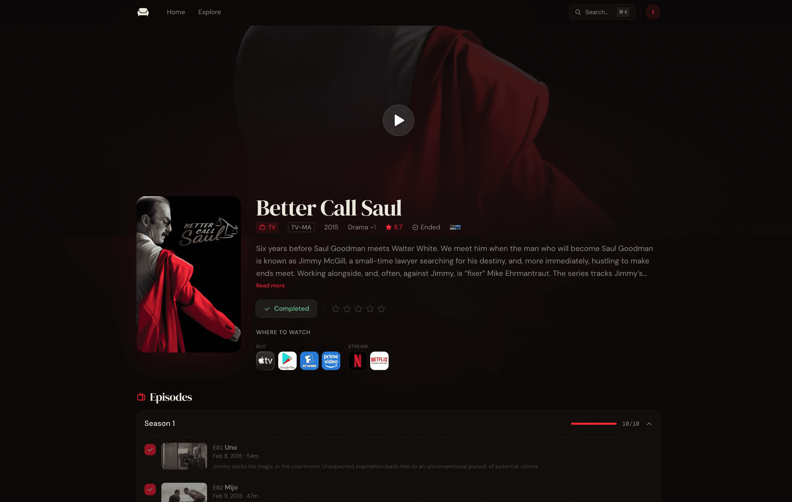

<p align="center">
  <a href="https://sofa.watch"></a><br />
  <a href="https://sofa.watch"><strong>Sofa</strong></a> — Self-hosted movie & TV tracker
</p>
<p align="center">
  <a href="LICENSE"></a>
  <a href="https://github.com/jakejarvis/sofa/actions/workflows/docker.yml"></a>
  <a href="https://github.com/jakejarvis/sofa/releases/latest"></a>
  <a href="https://github.com/jakejarvis/sofa"></a>
  <a href="https://codecov.io/gh/jakejarvis/sofa"></a>
  <a href="https://crowdin.com/project/sofa"></a>
</p>

[Sofa](https://sofa.watch) is a self-hosted movie and TV tracker for nerds. Track what you've watched, discover what's next, and plug your data into your existing home media stack. All without anything leaving your homelab. 🍿



## What it does

- Track episode-level progress for TV series and pick shows back up from a dedicated "Continue Watching" view
- Mark movies as watched to discover more like them
- Rate titles, browse cast and crew, and get recommendations based on what you are already tracking
- Search TMDB and explore trending movies and shows without leaving your own instance
- Show streaming availability from TMDB's US provider data
- Automatically log completed watches from Plex, Jellyfin, or Emby webhooks
- Import existing watch history, ratings, and watchlists from Trakt, Simkl, or Letterboxd
- Expose your watchlist as import lists for Sonarr and Radarr
- Runs on SQLite with local image caching, built-in backups, and no external database requirement
- Supports local accounts or OIDC SSO for private instances

> [!NOTE]
> Sofa is extremely US-centric right now, in terms of streaming providers, content rating systems, etc. Contributions to address this are more than welcome!

## Quick start

### Self-hosted

A minimal [`docker-compose.yml`](./docker-compose.yml) is provided in this repo. For most setups, the shortest path is:

1. Copy the example environment file:

```bash
cp .env.example .env
```

2. Fill in the required values:

```env
TMDB_API_READ_ACCESS_TOKEN=your_tmdb_read_access_token
BETTER_AUTH_SECRET=generate_a_long_random_secret
BETTER_AUTH_URL=http://localhost:3000
```

3. Start the container:

```bash
docker compose up -d
```

4. Open `http://localhost:3000` and create the first account. The first account becomes the admin automatically, and registration closes after that by default.

> The included Compose file uses `ghcr.io/jakejarvis/sofa:edge`. If you prefer to pin releases, switch to a published version tag like `ghcr.io/jakejarvis/sofa:<version>` or use the matching `jakejarvis/sofa:<version>` image on Docker Hub. Multi-arch images are published for `linux/amd64` and `linux/arm64`.

### Cloud

If you prefer to deploy Sofa to the cloud, there are several great options. All you'll need is the ability to run Docker containers and mount some form of persistent storage volume to `/data` within the container.

[](https://railway.com/deploy/AqGBLF?referralCode=4AUONK&utm_medium=integration&utm_source=template&utm_campaign=generic)

## Required setup

### TMDB

Sofa uses [TMDB](https://www.themoviedb.org/) for metadata, posters, cast, recommendations, and streaming availability. You need a TMDB API Read Access Token before the app can do anything useful.

Create one here:

- [TMDB signup](https://www.themoviedb.org/signup)
- [API settings](https://www.themoviedb.org/settings/api)

> [!TIP]
> We want the **API Read Access Token**, not the shorter API key.

### Auth secret

`BETTER_AUTH_SECRET` should be a long random string. To generate one:

```bash
npx @better-auth/cli@latest secret
# or
openssl rand -base64 32
```

### Public URL

Set `BETTER_AUTH_URL` to the real external URL of your instance. This especially matters for login flows and OIDC callbacks behind a reverse proxy (like nginx or Traefik).

## Configuration

| Variable                     | Required | Notes                                                                                           |
| ---------------------------- | -------- | ----------------------------------------------------------------------------------------------- |
| `TMDB_API_READ_ACCESS_TOKEN` | Yes      | TMDB metadata and discovery                                                                     |
| `BETTER_AUTH_SECRET`         | Yes      | Session and auth secret                                                                         |
| `BETTER_AUTH_URL`            | Yes      | Public base URL of the app                                                                      |
| `DATA_DIR`                   | No       | Root data directory. Defaults to `/data` in the container                                       |
| `IMAGE_CACHE_ENABLED`        | No       | Defaults to enabled. Set to `false` to use TMDB images directly instead of caching them locally |
| `LOG_LEVEL`                  | No       | `error`, `warn`, `info`, or `debug`                                                             |
| `OIDC_CLIENT_ID`             | No       | Enable OIDC when set with the matching secret and issuer                                        |
| `OIDC_CLIENT_SECRET`         | No       | OIDC client secret                                                                              |
| `OIDC_ISSUER_URL`            | No       | OIDC issuer URL                                                                                 |
| `OIDC_PROVIDER_NAME`         | No       | Login button label. Defaults to `SSO`                                                           |
| `OIDC_AUTO_REGISTER`         | No       | Defaults to `true`                                                                              |
| `DISABLE_PASSWORD_LOGIN`     | No       | Set to `true` to hide email/password login when OIDC is configured                              |

See [`.env.example`](./.env.example) for the full list.

## Integrations

Sofa ships with two kinds of integrations (for now): incoming watch activity and outgoing import lists.

### Incoming watch activity

- Plex: logs completed watches through a webhook URL generated in Sofa. Requires an active [Plex Pass](https://www.plex.tv/plex-pass/) license.
- Jellyfin: works through the Jellyfin Webhook plugin.
- Emby: logs completed watches through webhooks. Requires Emby Server 4.7.9+ and an [Emby Premiere](https://emby.media/premiere.html) subscription.

These integrations are user-specific, so each user can connect their own media server account and watch history.

### Outgoing import lists

- Sonarr: expose your Sofa TV watchlist as a custom import list
- Radarr: expose your Sofa movie watchlist as a custom import list

## Development

For local development:

```bash
bun install
cp .env.example .env
bun run dev
```

Useful commands:

- `bun run test`
- `bun run lint`
- `bun run format`
- `bun run check-types`
- `cd packages/db && bun run db:generate`
- `cd packages/db && bun run db:migrate`

## TMDB notice

This product uses the TMDB API but is not endorsed or certified by TMDB.

## License

[MIT](LICENSE)
